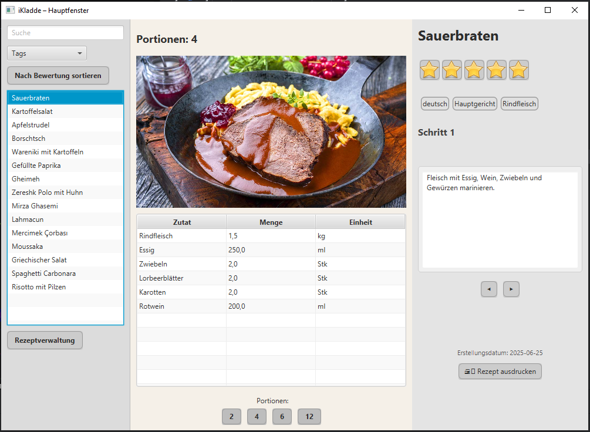
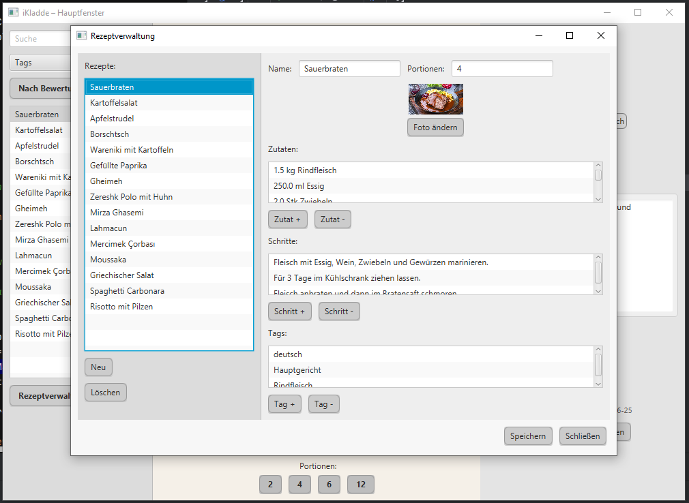

# iKladde – Digital Recipe Manager

**Author:** Eugen Sulakov  
**Status:** June 2025  
**Educational project (developed during retraining at GFN)**

---

## Features

- Manage recipes: add, edit, delete
- Edit ingredients, steps, and tags
- Add and display recipe images
- Adjust ingredient quantities for 2/4/6/12 servings
- Navigate through instructions step-by-step
- Search recipes by name
- Filter recipes by tags
- Sort recipes by rating
- Rate recipes with 1–5 stars
- Print button (not implemented)

*Planned future features: support for alternative CSS themes (skins), AI-powered suggestions (extension class prepared)*

## Project Structure (MVC)

- `model/` – data classes (e.g. Recipe, Ingredient, Step)
- `view/` – JavaFX-based user interface
- `controller/` – connects the logic between view and model
- `database/` – classes for database interaction (DAO)
- `photos/` – folder for storing recipe images
- `resources/` – CSS and static files

---

## How to Run

Main class:  
```java
de.gfn.ikladde.ikladde.IkladdeApp
```

Run with Maven:  
```bash
mvn clean javafx:run
```

---

## Test Data & Images

The recipes currently stored in the database are for demonstration only.  
They were created to showcase the application's functionality and are not intended for actual cooking.

Images used in the app were taken from freely available online sources and are used solely for development and design purposes.  
Please use copyright-free or own images when publishing or distributing the application.

---

## Notes

The print feature is currently a placeholder.  
Offline usage only – no login, no cloud storage.

---

# iKladde – Digitale Rezeptverwaltung

**Autor:** Eugen Sulakov  
**Stand:** June 2025  
**Lernprojekt im Rahmen der Umschulung bei GFN**

---

## Funktionen

- Rezepte hinzufügen, bearbeiten und löschen
- Zutaten, Schritte und Tags bearbeiten
- Rezeptbilder hinzufügen und anzeigen
- Zutatenmengen für 2/4/6/12 Portionen anpassen
- Schrittweise Kochanleitung durchblättern
- Rezepte nach Name durchsuchen
- Nach Tags filtern
- Nach Bewertung sortieren
- Rezepte mit 1–5 Sternen bewerten
- Druckbutton (noch nicht umgesetzt)

*Zukünftige Erweiterungen: alternative CSS-Themes (Skins), KI-Unterstützung geplant (Platzhalterklasse vorhanden)*

## Projektstruktur (MVC)

- `model/` – Datenklassen (Rezept, Zutat, Schritt etc.)
- `view/` – Benutzeroberfläche mit JavaFX
- `controller/` – Verbindet Ansicht und Logik
- `database/` – Klassen zur Datenbankschnittstelle (DAO)
- `photos/` – Ordner für Rezeptbilder
- `resources/` – CSS-Dateien und statische Inhalte

---

## Start der Anwendung

Hauptklasse:  
```java
de.gfn.ikladde.ikladde.IkladdeApp
```

Starten mit Maven:  
```bash
mvn clean javafx:run
```

---

## Testdaten & Bilder

Die aktuell in der Datenbank enthaltenen Rezepte dienen ausschließlich Demonstrationszwecken.  
Sie wurden zur Veranschaulichung der App-Funktionen erstellt und sind keine echten Kochanleitungen.

Die verwendeten Bilder stammen aus frei zugänglichen Quellen im Internet und werden nur zu Entwicklungs- und Designzwecken genutzt.  
Für Veröffentlichung oder Weitergabe bitte nur lizenzfreie oder eigene Bilder verwenden.

---

## Hinweise

Die Druckfunktion ist momentan ein Platzhalter.  
Die Anwendung funktioniert offline – keine Anmeldung, keine Cloud.


## Screenshots

### Hauptfenster (Main Window)


### Rezeptverwaltung (Recipe Management)
